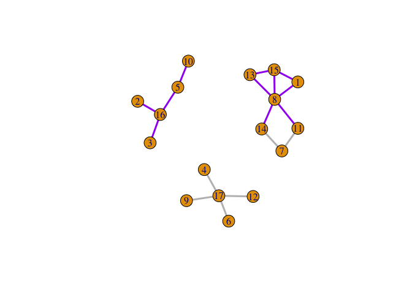

<!-- README.md is generated from README.Rmd. Please edit that file -->

# ExprNet

<!-- badges: start -->
<!-- badges: end -->

ExprNet is a toy model studying expressions of selected edges (namely a
sub-network) on a network. We aim to characterize how the lengths of
selected edges vary between two phenotypes based on t tests results. Two
statistics, $AT1$ and $AT2$, are computed to summarize the t tests
results and distinguish the differentially expressed patterns of the
sub-network.

## Method

The input includes data for each phenotype and the network. The user
also needs to select the sub-network either by specifying edges to be
included or specifying a list of vertices. In the latter case, all edges
on the network between these vertices will be included.

### Algorithm

Consider two phenotypes A and B. Denote $V_i^X$ as the expression value
of vertex $i$ in phenotype $X$, where $X \in \{A, B\}$. Let
$E_{ij}^X := V_i^X - V_j^X$ be the difference in the expression values
of $V_i$ and $V_j$ in phenotype $X$, given that $\textit{Vertex}\ i$ and
$\textit{Vertex}\ j$ are connected on the network. Let $n$ be the total
number of edges on the network. We treat $E_{ij}^A$ and $E_{ij}^B$ as
expression levels of the interactions between $\textit{Vertex}\ i$ and
$\textit{Vertex}\ j$ (namely the length of this edge) respectively if
they are connected.

The overall procedure breaks into four steps:

1.  Compute $E_{ij}^A$ and $E_{ij}^B$ for all connected edges on the
    network using samples of phenotypes $A$ and $B$ respectively.

2.  Conduct two-sample Welch’s t-test (t-test on sample means assuming
    heteroscedasticity) on each of the n edges. Denote the obtained t
    statistics as $\{t_1, t_2, ..., t_n\}$. Obtain the percentiles
    $\{p_1, p_2, ..., p_n\}$ of these t statistics by
    $$p_k := \frac{1}{n} \sum_{l=1}^{n} \mathbb{I}(t_l \leq t_k)$$ where
    $\mathbb{I}$ is the indicator function. In other words, $p_k$ is the
    proportion of t statistics that are less than or equal to $t_k$.

3.  Suppose the user-specified sub-network consists of $m$ edges.
    Extract the percentiles of these edges from $\{p_1, p_2, ..., p_n\}$
    and denote them as $\{p'_1, p'_2, ..., p'_m\}$.

4.  Compute the following statistics ($AT1$ stands for *Area of Type I*,
    $AT2$ stands for *Area of Type II*)

<!-- -->

1)  $$AT1 := 1 - \frac{1}{m} \sum_{k=1}^m p'_k$$

2)  $$AT2 := \frac{1}{m} \sum_{k=1}^m |p'_k - 0.5|$$

### Hypothesis testing

Test $H_0$: *all interactions in the sub-network (namely all selected
edges) express randomly between phenotype A and B*. Under the
assumptions that $t_1, t_2, ..., t_n \stackrel{i.i.d}{\sim} N(0, 1)$ and
$n$ is sufficiently large, $m(1-AT1) \sim Irwin-Hall(m)$, where
$Irwin-Hall(m)$ is the distribution of sum of $m$ i.i.d. $Unif(0,1)$
random variables. This null distribution is used to obtain the p-value
of $AT1$.

The p-value of $AT2$ is obtained via permutation test. The sample label
is permuted and the resulting $AT2$ is computed. Since a large number of
permutations are usually needed, this process can take some time on
large network and sample data.

## Installation

You can install the development version of ExprNet from
[GitHub](https://github.com/) with:

``` r
# install.packages("devtools")
devtools::install_github("WenbinWu2001/ExprNet")
```

## Example

This is a basic example which shows you how to solve a common problem:

Suppose we want to characterize the differential expression behavior of
a biological process <GO:0006306> *DNA_methylation* between two cancers,
LGG and GBM, on an example gene regulatory network.

Now we import the example network and plot it. Each vertex stands for a
gene and is represented by a numeric index. Each edge stands for a known
interaction between the genes. The purple edges (along with the
corresponding vertex genes) constitute the involved interactions in
<GO:0006306> *DNA_methylation*. We want to study how these edges or this
sub-network behave differentially between LGG and GBM.

``` r
library(ExprNet)
#> Loading required package: igraph
#> 
#> Attaching package: 'igraph'
#> The following objects are masked from 'package:stats':
#> 
#>     decompose, spectrum
#> The following object is masked from 'package:base':
#> 
#>     union

network <- read_graph(here::here("demo/network_info", "network"), format = "edgelist")
network <- as.undirected(network)

# select edges associated with the GO term and plot the sub-network
edge_pair_selected <- c("1-8", "1-15", "2-16", "3-16", "5-10", "5-16", "8-11", "8-13", "8-14", "8-15", "13-15")
selected_edges <- E(network, unlist(strsplit(edge_pair_selected, "-")))
E(network)$color[E(network) %in% selected_edges] <- "purple"
E(network)$color[!(E(network) %in% selected_edges)] <- "grey"
plot(network, edge.width = 3)
```



We now read the data of LGG and GBM, which has been normalized in
advance. Each row corresponds to a vertex gene, while each column
corresponds to a sample. The first column is the numeric vertex index.

``` r
data_type1 <- readr::read_csv(here::here("demo/data", paste0("LGG", ".csv")), show_col_types = FALSE)
data_type2 <- readr::read_csv(here::here("demo/data", paste0("GBM", ".csv")), show_col_types = FALSE)
head(data_type1)
#> # A tibble: 6 × 6
#>    ...1 LGG_1 LGG_2 LGG_3 LGG_4 LGG_5
#>   <dbl> <dbl> <dbl> <dbl> <dbl> <dbl>
#> 1     1  2.00  2.00  2.00  2.22  2.22
#> 2     2  2.22  2.22  1.72  2.00  2.00
#> 3     3  3.01  3.29  2.51  3.29  3.73
#> 4     4  4.85  3.52  4.85  4.85  4.85
#> 5     5  4.29  4.85  3.73  4.29  4.29
#> 6     6  2.51  1.72  2.22  2.51  2.83
```

Now we compute the defined AT1 and AT2 statistics, save the results and
plot the sub-network with selected edges only.

``` r
analysis_ExprNet(data_type1, data_type2, network,
                 edge_pair_selected = edge_pair_selected,
                 type1_name = "LGG", type2_name = "GBM",
                 subnet_label = "Demo_GO0006306_DNA_methylation(LGG-GBM)",
                 save_edge_res = TRUE, save_plot = TRUE, save_dir = here::here("demo"),
                 vertex.label.cex = 1, vertex.size = 15, edge.width = 4)
#> 
#> Data read successfully.
#> 17 features
#> 5 samples for phenotype 1
#> 5 samples for phenotype 2.
#> Graph imported successfully.
#> There are 17 vertices and 17 edges in the graph.
#> 
#> ---Computing edge length and t statistics---
#> 3  /  17  Edges Computed 
#> 6  /  17  Edges Computed 
#> 10  /  17  Edges Computed 
#> 13  /  17  Edges Computed 
#> 17  /  17  Edges Computed 
#> Among 17 edge distances, 
#> 4 of them have significant differences at 0.05 level.
#> 5 of them > 0.
#> 12 of them < 0.
#> 
#> ---Saving results---
#> Please find results in the subfolder result_ExprNet
#> 
#> The subnetwork consists of  11  edges.
#> 
#> ---Computing AT1---
#> AT1 =  0.67 , pval_AT1 =  0.0529 
#> 
#> ---Computing AT2---
#> The permutation test may take some time, especially for high dimension. Please stay tuned.
#> Parallel Computing:  8  cores registered.
#> AT2 computed.
#> AT2 =  0.47 , pval_AT2 =  0
#> Please find results in the subfolder result_ExprNet
```


    #> ---Plot saved---
    #> $subnet_label
    #> [1] "Demo_GO0006306_DNA_methylation(LGG-GBM)"
    #> 
    #> $num_edges
    #> [1] 11
    #> 
    #> $vertex_idx_selected
    #> NULL
    #> 
    #> $edge_pair_selected
    #>  [1] "1-8"   "1-15"  "2-16"  "3-16"  "5-10"  "5-16"  "8-11"  "8-13"  "8-14" 
    #> [10] "8-15"  "13-15"
    #> 
    #> $t_stat
    #>  [1] "2.32077365191761"   "0.586623415886203"  "-1.74399941037296" 
    #>  [4] "-3.02498017335084"  "-2.10689831544308"  "0.327059740937537" 
    #>  [7] "-2.81959795568343"  "-1.00712074968105"  "-0.289904126578791"
    #> [10] "1.74407437581549"   "-2.50230299711317" 
    #> 
    #> $t_stat_perc
    #>  [1] 1.0000000 0.8823529 0.0000000 0.0000000 0.0000000 0.8235294 0.0000000
    #>  [8] 0.0000000 0.0000000 0.9411765 0.0000000
    #> 
    #> $AT1
    #> [1] 0.6684492
    #> 
    #> $pval_AT1
    #> [1] 0.05294933
    #> 
    #> $AT2
    #> [1] 0.4679144
    #> 
    #> $pval_AT2
    #> [1] 0
